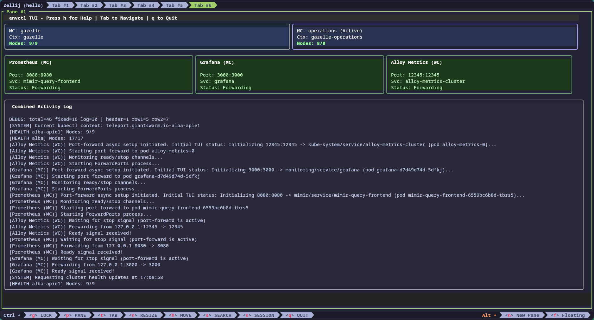

# envctl 🚀

Your friendly environment connector for Giant Swarm!

`envctl` is a command-line tool designed to simplify connecting your development environment, particularly [Model Context Protocol (MCP)](https://github.com/modelcontext/protocol) servers used in IDEs like Cursor, to Giant Swarm Kubernetes clusters and services like Prometheus.

It automates the process of logging into clusters via Teleport (`tsh`) and setting up necessary connections like port-forwarding for Prometheus (Mimir).

## Features ✨

*   **Simplified Connection:** Connect to management and workload clusters with a single command.
*   **Automatic Context Switching:** Sets your `kubectl` context correctly.
*   **Prometheus Port-Forwarding:** Handles `kubectl port-forward` for the Mimir query frontend automatically.
*   **Interactive Terminal UI:** View cluster status, manage port forwards, and monitor connections in a polished terminal interface.
*   **Teleport Integration:** Uses your existing `tsh` setup for Kubernetes access.
*   **Shell Completion:** Provides dynamic command-line completion for cluster names (Bash & Zsh).

## Releases & Changelog 📦

Releases are automatically created when pull requests are merged into the main branch. Each merged PR triggers a new release with an incremented version number.

The changelog for each release is automatically generated and included in the release notes on the [GitHub Releases page](https://github.com/giantswarm/envctl/releases).

Pre-built binaries for multiple platforms (Linux, macOS, Windows) are available for download from the Releases page.

## Prerequisites 📋

Before using `envctl`, ensure you have the following installed and configured:

1.  **Go:** Version 1.21 or later ([Installation Guide](https://go.dev/doc/install)).
2.  **Teleport Client (`tsh`):** You need `tsh` installed and logged into your Giant Swarm Teleport proxy.
3.  **`kubectl`:** The Kubernetes command-line tool.

## Installation 🛠️

### Option 1: Download from GitHub Releases

Download the pre-built binary for your platform from the [Releases page](https://github.com/giantswarm/envctl/releases):

```zsh
# For macOS (Intel)
curl -L https://github.com/giantswarm/envctl/releases/latest/download/envctl_darwin_amd64 -o envctl
chmod +x envctl
mv envctl /usr/local/bin/

# For macOS (Apple Silicon)
curl -L https://github.com/giantswarm/envctl/releases/latest/download/envctl_darwin_arm64 -o envctl
chmod +x envctl
mv envctl /usr/local/bin/

# For Linux (AMD64)
curl -L https://github.com/giantswarm/envctl/releases/latest/download/envctl_linux_amd64 -o envctl
chmod +x envctl
mv envctl /usr/local/bin/
```

### Option 2: Build from Source

1.  Clone this repository (or ensure you are in the project directory).
2.  Build the binary:
    ```sh
    go build -o envctl .
    ```
3.  (Optional) Move the `envctl` binary to a directory in your `$PATH` (e.g., `/usr/local/bin` or `~/bin`):
    ```sh
    mv envctl /usr/local/bin/
    ```

## Usage 🎮

The primary command is `envctl connect`:

```
envctl connect <management-cluster> [workload-cluster-shortname]
```

This command launches the interactive TUI by default, showing you real-time status of your clusters and port-forwards.

Other commands:

```
# Show current version
envctl version

# Update envctl to the latest release
envctl self-update

# Use the CLI mode without TUI (for scripts or CI environments)
# This mode will:
# - Log into the specified cluster(s) via tsh.
# - Set the kubectl context.
# - Start port-forwarding for:
#   - Prometheus (MC) on localhost:8080
#   - Grafana (MC) on localhost:3000
#   - Alloy Metrics (on localhost:12345):
#     - For the Workload Cluster (WC) if specified.
#     - For the Management Cluster (MC) if only an MC is specified.
# - Print a summary and instructions, then exit. Port-forwards will run in the background.
envctl connect <management-cluster> [workload-cluster-shortname] --no-tui
```

**Arguments for `connect`:**

*   `<management-cluster>`: (Required) The name of the Giant Swarm management cluster (e.g., `wallaby`, `enigma`).
*   `[workload-cluster-shortname]`: (Optional) The *short* name of the workload cluster (e.g., `plant-lille-prod` for `wallaby-plant-lille-prod`, `ve5v6` for `enigma-ve5v6`).

**Examples:**

1.  **Connect to a Management Cluster only:**

    ```bash
    envctl connect enigma
    ```

    *   Launches an interactive terminal UI
    *   Logs into `enigma` via `tsh kube login enigma`.
    *   Sets the current `kubectl` context to `teleport.giantswarm.io-enigma`.
    *   Starts port-forwarding for Prometheus (MC) on `localhost:8080`, Grafana (MC) on `localhost:3000`, and Alloy Metrics (MC) on `localhost:12345`.
    *   Displays cluster health and connection status
    *   Allows management of port-forwards and contexts

2.  **Connect to a Management and Workload Cluster:**

    ```bash
    envctl connect wallaby plant-cassino-prod
    ```

    *   Logs into `wallaby` via `tsh kube login wallaby`.
    *   Logs into the *full* workload cluster name (`wallaby-plant-cassino-prod`) via `tsh`.
    *   Sets the current `kubectl` context to the *full* workload cluster name (`teleport.giantswarm.io-wallaby-plant-cassino-prod`).
    *   Starts port-forwarding for Prometheus using the *management cluster* context (`teleport.giantswarm.io-wallaby`) to `localhost:8080`.
    *   Starts port-forwarding for Grafana using the *management cluster* context (`teleport.giantswarm.io-wallaby`) to `localhost:3000`.
    *   Starts port-forwarding for Alloy metrics using the *workload cluster* context (`teleport.giantswarm.io-wallaby-plant-cassino-prod`) to `localhost:12345`.
    *   Prints a summary and instructions for MCP.

## Terminal User Interface 🖥️

When running `envctl connect`, the Terminal User Interface (TUI) provides a visual dashboard to monitor and control your connections:



### Key Features

- **Cluster Status Monitoring**: View real-time health status of both management and workload clusters
- **Port Forward Management**: Monitor active port forwards with status indicators
- **Log Viewer**: View operation logs directly in the terminal
- **Keyboard Navigation**: Easily navigate between panels with Tab/Shift+Tab
- **Dark Mode Support**: Toggle between light and dark themes with 'D' key

### Keyboard Shortcuts

| Key          | Action                                   |
|--------------|------------------------------------------|
| Tab          | Navigate to next panel                   |
| Shift+Tab    | Navigate to previous panel               |
| q / Ctrl+C   | Quit the application                     |
| r            | Restart port forwarding for focused panel|
| s            | Switch Kubernetes context                |
| N            | Start new connection                     |
| h            | Toggle help overlay                      |
| L            | Toggle log overlay                       |
| D            | Toggle dark/light mode                   |
| z            | Toggle debug information                 |
| Esc          | Close help/log overlay                   |

For more details on the implementation and architecture of the TUI, see the [TUI documentation](docs/tui.md).

## Shell Completion 🧠

`envctl` supports shell completion for cluster names.

**Setup (Zsh):**

```bash
# For Oh My Zsh
./envctl completion zsh > ~/.oh-my-zsh/completions/_envctl

# Or for standard Zsh (add to ~/.zshrc if needed: fpath=(~/.zsh/completion $fpath))
mkdir -p ~/.zsh/completion
./envctl completion zsh > ~/.zsh/completion/_envctl
exec zsh # Reload shell or run compinit
```

**Setup (Bash):**

```bash
# System-wide (requires sudo)
sudo mkdir -p /etc/bash_completion.d/
./envctl completion bash | sudo tee /etc/bash_completion.d/envctl

# Or for current user (add to ~/.bashrc)
echo "source <(./envctl completion bash)" >> ~/.bashrc
source ~/.bashrc # Reload shell
```

Now you can use TAB to complete cluster names:

```bash
envctl connect <TAB>              # Shows management clusters
envctl connect wallaby <TAB>      # Shows short names of workload clusters for wallaby
```

## MCP Integration Notes 💡

*   After running `envctl connect`, services should be available at:
    *   Prometheus: `http://localhost:8080/prometheus` (context: Management Cluster)
    *   Grafana: `http://localhost:3000` (context: Management Cluster)
    *   Alloy Metrics: `http://localhost:12345` (context: Workload Cluster if specified, otherwise Management Cluster)
*   Ensure your `mcp.json` (e.g., `~/.cursor/mcp.json`) has the correct `PROMETHEUS_URL` for the Prometheus MCP server:
    ```json
    {
      "mcpServers": {
        "kubernetes": {
          "command": "npx",
          "args": ["mcp-server-kubernetes"]
        },
        "prometheus": {
          "command": "uv", // Or your specific command
          "args": [ ... ], // Your specific args
          "env": {
            "PROMETHEUS_URL": "http://localhost:8080/prometheus"
          }
        }
        // ... other servers ...
      }
    }
    ```
*   You may need to **restart your MCP servers** or your IDE after running `envctl connect` for them to pick up the new Kubernetes context and Prometheus connection.

## Future Development 🔮

*   Support for connecting to Loki.
*   Direct SSH access integration.
*   Connections for specific cloud providers (AWS, Azure, GCP).
*   More robust background process management.

--- 
