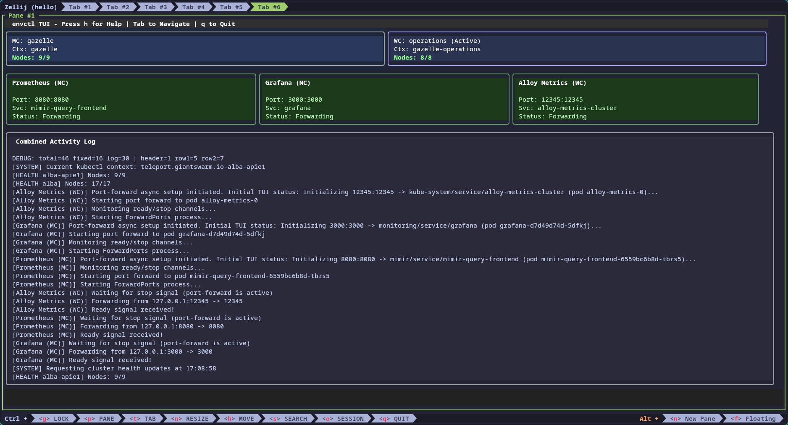

# Terminal User Interface (TUI) Documentation

The `envctl` TUI is a polished, interactive terminal interface built with the [Bubble Tea](https://github.com/charmbracelet/bubbletea) framework from Charmbracelet. It provides a dashboard-like experience for monitoring and managing connections to Giant Swarm Kubernetes clusters.



## Overview

The TUI is designed to provide real-time feedback about:
- Cluster connection status (Management and Workload Clusters)
- Node health for connected clusters
- Active port forwarding processes
- MCP (Model Context Protocol) server status
- Operation logs and events

It also enables interactive operations like:
- Starting, stopping, and restarting services
- Navigating between service panels with keyboard shortcuts
- Switching Kubernetes contexts
- Viewing detailed logs and configurations
- Monitoring service dependencies

## Screenshots

### Main Interface


The main interface provides a complete view of:
- Header with navigation hints
- Management and Workload Cluster status panes
- Port forwarding panels for each service
- MCP server panels with tool information
- Activity log with real-time updates
- Status bar showing overall system health

### Help Overlay


The help overlay displays all available keyboard shortcuts, organized by category.

### Log Overlay


The log overlay provides expanded view of logs, particularly useful for:
- Debugging connection issues
- Monitoring service activity
- Viewing detailed error messages

### MCP Config Overlay
The MCP config overlay (accessed with 'C') displays the JSON configuration for MCP servers, which can be copied to clipboard.

### MCP Tools Overlay
The MCP tools overlay (accessed with 'M') shows available tools for each running MCP server.

### Dark Mode


Dark mode provides optimal visibility in low-light environments and reduced eye strain.

## Architecture

The TUI is part of a larger service-based architecture that provides clean separation of concerns:

### Service Architecture Overview

1. **Service Layer** (`internal/services/`): Defines core service interfaces and implementations
2. **Orchestrator** (`internal/orchestrator/`): Manages service lifecycle and dependencies
3. **API Layer** (`internal/api/`): Provides clean interfaces for service interaction
4. **TUI Layer** (`internal/tui/`): Implements the terminal interface using MVC pattern

### TUI Component Structure (MVC)

The TUI follows the Model-View-Controller (MVC) pattern:

#### Model (`internal/tui/model/`)
Maintains the application state and data structures:
- `types.go`: Core `Model` struct, enums, and data types
- `messages.go`: All `tea.Msg` types for internal communication
- `init.go`: Model initialization and setup

#### View (`internal/tui/view/`)
Responsible for rendering the UI:
- `render.go`: Main render function and mode switching
- `render_dashboard.go`: Dashboard layout orchestration
- `render_context_panes.go`: K8s connection panels
- `render_port_forwarding.go`: Port forward service panels
- `render_mcp_proxies.go`: MCP server panels
- `render_overlays.go`: Help, log, and config overlays
- `colors.go`, `icons.go`: Visual elements (imports from `internal/color/`)

#### Controller (`internal/tui/controller/`)
Handles user input and orchestrates updates:
- `app.go`: Main `AppModel` implementing `tea.Model`
- `update.go`: Central message handling and dispatch
- `helpers.go`: Utility functions
- `program.go`: Program initialization

## Service Types

The TUI manages three main types of services:

### 1. Kubernetes Connections
- Establish and maintain connections to clusters via Teleport
- Display connection health and node status
- Support for Management Cluster (MC) and Workload Cluster (WC)

### 2. Port Forwards
- Create and manage kubectl port-forward tunnels
- Monitor connection status and handle automatic recovery
- Configurable through YAML configuration files

### 3. MCP Servers
- Run Model Context Protocol servers for AI integration
- Support for both local command and container-based servers
- Display available tools when servers are healthy

## Message System

The TUI uses an event-driven message system:

### Event Sources
1. **Service State Changes**: From the orchestrator when services change state
2. **Log Events**: From the centralized logging system
3. **User Input**: Keyboard and mouse events
4. **Periodic Updates**: Timer-based refresh of service data

### Message Flow
```
Service Event → API Layer → TUI Channel → Controller Update → Model Update → View Render
```

## Styling

All UI styling is centralized in the `internal/color/` package:

- Adaptive colors that work in both light and dark modes
- Consistent semantic colors (success=green, error=red, etc.)
- Reusable style compositions
- Status-specific styling for service panels

See the [TUI Style Guide](./tui-styleguide.md) for detailed styling information.

## Key Features

### Service Management

- **Start/Stop/Restart**: Control services with keyboard shortcuts
- **Dependency Awareness**: Services start/stop in dependency order
- **Health Monitoring**: Real-time health status for all services
- **Automatic Recovery**: Failed services are automatically restarted

### Keyboard Navigation

| Key | Action |
|-----|--------|
| Tab/Shift+Tab | Navigate between panels |
| ↑/↓ or j/k | Move focus up/down |
| Enter | Start stopped service |
| r | Restart focused service |
| x | Stop focused service |
| s | Switch to focused cluster's context |
| h or ? | Show help overlay |
| L | Show log overlay |
| C | Show MCP config overlay |
| M | Show MCP tools overlay |
| D | Toggle dark mode |
| z | Toggle debug mode |
| q or Ctrl+C | Quit application |

### Focus System

- Focused panels have distinct blue thick borders
- Focus affects context-specific operations
- Tab through all services in order
- Visual feedback for focused element

### Responsive Layout

The TUI automatically adapts to terminal size:
- Dynamic space distribution between components
- Graceful degradation for small terminals
- Overlay modes for constrained spaces
- Maintains aspect ratios and readability

## Implementation Details

### Service Integration

The TUI integrates with services through the API layer:

```go
// Service APIs used by TUI
type Model struct {
    OrchestratorAPI api.OrchestratorAPI
    K8sServiceAPI   api.K8sServiceAPI
    PortForwardAPI  api.PortForwardServiceAPI
    MCPServiceAPI   api.MCPServiceAPI
}
```

### State Management

The TUI maintains:
1. **Cached Service Data**: For efficient rendering
2. **UI State**: Focus, overlays, viewports
3. **Event Subscriptions**: For real-time updates

### Performance Optimizations

- Selective re-rendering based on changed data
- Efficient event handling through channels
- Periodic refresh with configurable intervals
- Resource cleanup on service stop

## Configuration

The services displayed in the TUI are configured through YAML files:

### Port Forwards
```yaml
portForwards:
  - name: prometheus
    namespace: monitoring
    service: prometheus-server
    localPort: 9090
    remotePort: 80
    kubeContextTarget: mc
```

### MCP Servers
```yaml
mcpServers:
  - name: kubectl-context
    type: localCommand
    command: mcp-kubectl-context
    port: 3100
    dependencies: ["k8s-mc-myinstallation"]
```

## Troubleshooting

### Common Issues

1. **Services Not Starting**: Check dependencies and logs
2. **Layout Issues**: Resize terminal or check font settings
3. **Performance**: Reduce log verbosity or increase refresh interval

### Debug Mode

Enable debug mode with 'z' key to see:
- Additional log messages
- Service state details
- Performance metrics

## Development

### Adding a New Service Type

1. Implement the `services.Service` interface
2. Add API interface in `internal/api/`
3. Register with orchestrator
4. Add rendering in `internal/tui/view/`

### Modifying the UI

1. Update model types for new state
2. Add message types for interactions
3. Handle messages in controller
4. Update view rendering

### Testing

The TUI includes comprehensive tests:
- Unit tests for model logic
- Golden file tests for view rendering
- Integration tests with mock services

## Future Enhancements

- Service grouping and filtering
- Custom keyboard shortcuts
- Export/import of service configurations
- Performance metrics dashboard
- WebSocket support for remote monitoring 